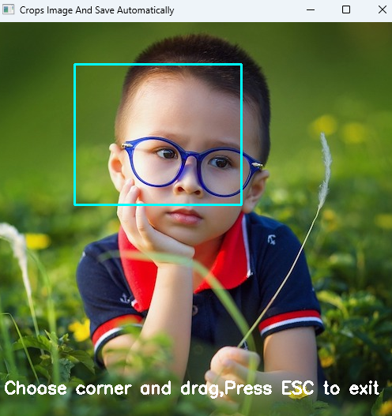

# Image Cropping Tool with OpenCV  

This Python script allows users to interactively crop a region of an image using their mouse and save the cropped portion automatically. It utilizes the OpenCV library for image handling and drawing.  


## Features  

- Load an image from a specified path.  
- Interactively select a bounding box using the mouse.  
- Save the cropped region as a new image file automatically.  
- Simple GUI to visualize the cropping process.  

## Requirements  

- Python 3.6 or later  
- OpenCV (cv2)  

Install OpenCV using pip if you don't already have it:  
```bash
pip install opencv-python
